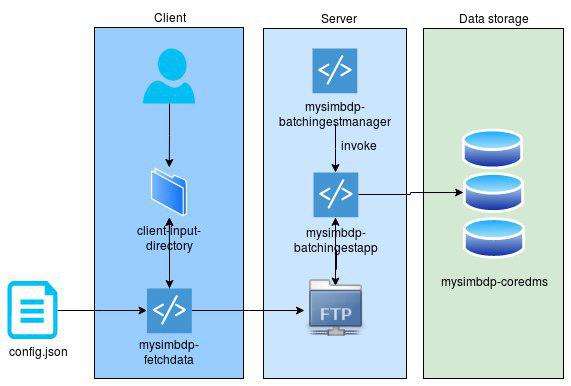

# Part 1: Design

Given the requirements, I decided to split up the system into three disjoint parts: client, server, and data storage.
The use case scenario would look like this:
A client puts file(s) into a directory, which is watched by a program running on their machine. The program then sends the files to the server for staging (where they are cached). The server listens to file uploads and triggers a client program (stored on the server) that processes the files and sends them to a data storage.

The architecture of the system is presented below in more details:

On the client side there are three key components:
* `client-input-directory` – directory where client puts files.
* `mysimbdp-fetchdata` – a Node.js app that listens to chages in the directory and sends the files to the server.
* `config.json` – json file with the configuration for `mysimbdp-fetchdata`.

On the server side, the components are:
* `clientbatchingestapp` - a client program that, given a connection string to a MongoDB cluster, processes the files and sends them to MongoDB.
* `mysimbdp-batchingestmanager` – a Node.js app that is acting like an FTP server; listens to additions of new files and, based on the user adding them, triggers `clientbatchingestapp`.

For the data storage, I decided to reuse the MongoDB cluster I set up for the first assignment. It is running on MongoDB Atlas and has one primary and two secondary shards.
